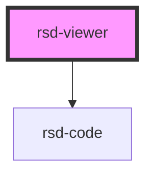

# rsd-viewer

<!-- Auto Generated Below -->

## Properties

| Property      | Attribute      | Description | Type                                                                                                                                       | Default     |
| ------------- | -------------- | ----------- | ------------------------------------------------------------------------------------------------------------------------------------------ | ----------- |
| `model`       | `model`        |             | `string \| { '@type': "RSDModel"; elements: readonly MUserType[]; services: readonly MService<MOperation>[]; errors: readonly MError[]; }` | `undefined` |
| `projectname` | `projectname`  |             | `string`                                                                                                                                   | `undefined` |
| `showCurl`    | `show-curl`    |             | `boolean`                                                                                                                                  | `false`     |
| `showREST`    | `show-r-e-s-t` |             | `boolean`                                                                                                                                  | `true`      |

## Dependencies

### Depends on

- [rsd-code](.)

### Graph

----------------------------------------------

*Built with [StencilJS](https://stenciljs.com/)*
